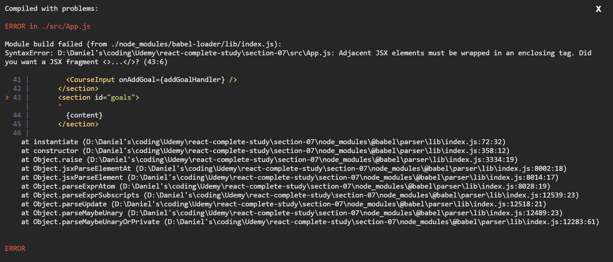
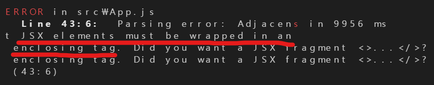
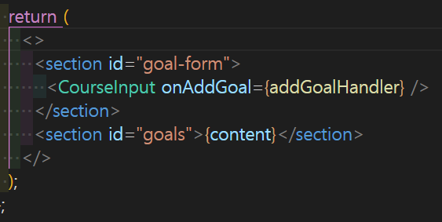
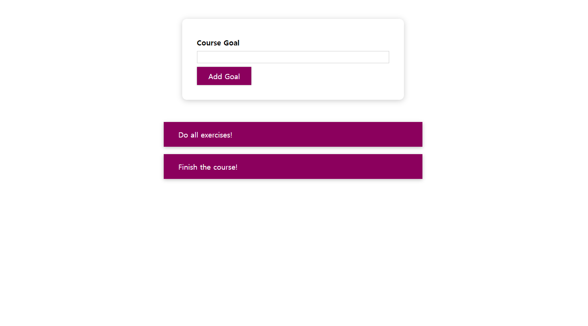
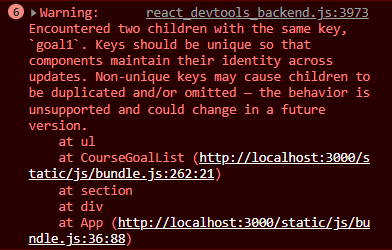
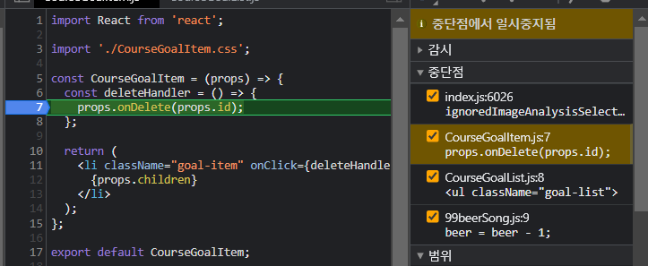
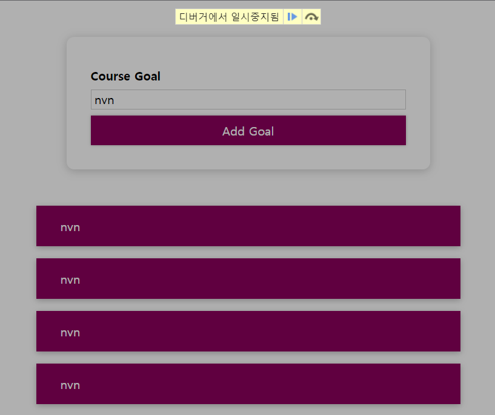
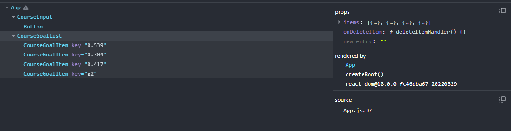

# Debugging React Apps

개발을 하다보면 우리는 항상 **에러**를 마주한다. 조건이 항상 다르기때문에 우리가 경험하는 에러는 아주 다양하다. 이러한 이유로 아마 우리는 에러 없는 코드를 절대 짤 수 없을 것이다.

"어짜피 에러는 발생할 것이다." 라는 사실을 받아들였다면, 다음 방향은 **그것을 어떻게 해결할까?**가 될 것이다.

에러를 잘 해결하는 것은 좋은 개발자가 되기 위한 스킬이기도 하다. 내가 마주한 에러를 해결하기 위해 바로 도움을 요청하기 보다는 **스스로 해결해보려는 자세**를 갖추어보자.

## 에러 메시지 이해하기

다음과 같은 에러가 발생하는 것은 일반적인 일이다.

당황하지 말고 우선 에러 메시지가 어떤 것을 우리에게 경고하는지 읽어보자!

> JSX 요소는 반드시 하나의 태그로 감싸져야 한다.

아하! 우리가 해당 내용을 코드에서 놓쳤기 때문에 버그가 발생하였고, 그것을 React 엔진이 캐치해서 알려주는 것구나!!

그러면 에러 메시지를 따라 하나의 태그로 감싼다면

문제가 해결되고 웹페이지는 잘 작동하게 된다.

간단한 에러였지만, 이와 같이 우선 **에러 메시지를 파악하고 해결하려는 자세**가 좋은 개발자가 되는 지름길이라고 한다.

## 리액트 앱에서 디버깅 & 분석하기

명확한 에러 메시지가 주어지는 경우에는 비교적 디버깅하기 쉽다. 그렇다면, 에러 메시지가 없지만, 기능적으로 문제가 있을 때는 어떻게 디버깅 해야할까?

위에서 에러를 하나 해결했음에도 불구하고, Add Goal을 통해 새로운 목표를 추가했더니 다음과 같은 에러가 발생하였다.

> 두 개의 자식 컴포넌트가 같은 key를 가지고 있다는 에러 메시지이다.

> 유일하지 않은 key값을 가진다면 발생 이벤트가 우리가 예상하지 않는 방향으로 업데이트 될 것이라고 경고하고 있다.

문제는 새로운 Goal을 만드는 함수에서 같은 id를 전달하는 것이었다. 이때문에 개발자 도구에서는 미리 오류 메시지를 띄어 개발자가 발생 가능성 있는 오류를 미리 해결할 수 있도록 도와준다.

이 에러 메시지는 아까와 달리, 런타임 에러를 발생시키지 않아 앱이 정상 작동하지만, 추후 기능상 오류가 있을 수 있다.

하지만, 이 또한 에러 메시지를 참고한다면 쉽게 해결할 수 있다. 에러 메시지에서 **경고하는 점**그리고 **어떤 부분에서 문제 발생**이 예상되는지 파악하여 에러를 해결하면 될 것이다.

### **브레이크 포인트 이용**

위의 오류를 조금 더 쉽게 찾기 위해 debugger를 사용할 수 있다.
개발자 도구 → 소스 → 예상되는 컴포넌트

의심되는 코드 line에 중단점을 찍고 해당 기능을 다시 작동시켜본다. 그러면 문제가 발생한 부분에서 작업이 중단될 것이고, 디버거에 의해 앱이 일시중지 된다.

break-point를 이용한다면, 단계별로 코드를 확인할 수 있어 분석하기 용이하다.

## React DevTools 이용하기

지금까지의 방법만으로도 대부분의 에러를 잡을 수 있을 것이다.
하지만, React에 조금 더 최적화된 **React DevTools**가 있다.

※ 크롬 확장 스토어에서 추가하고 사용하면 된다.

보다시피, React DevTools를 설치하고 개발자 도구를 보면 **Components**, **profiler**탭이 생긴 것을 알 수 있을 것이다.
디버깅과 어플리케이션 분석을 위해서는 Components 탭에 들어가면 된다.

위와 같이 React 어플리케이션의 컴포넌트 트리가 깔끔하게 정리되어 있고, 해당 컴포넌트에 state와 props, 사용 hooks 등을 파악할 수 있다.

이처럼 React DevTools는 React앱을 분석하고 디버깅할 때 유용한 툴이다.
