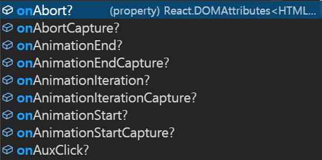
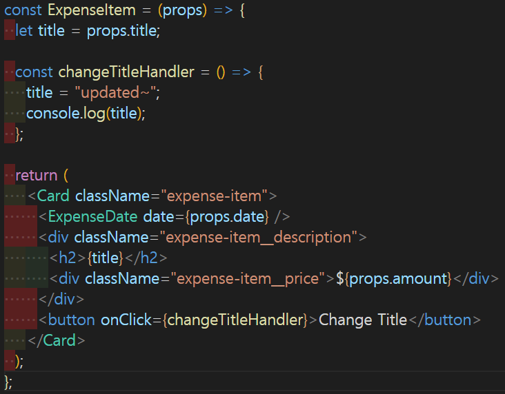
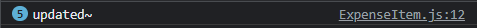
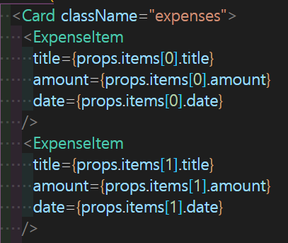

# React State & Working with Events

## 이 섹션에서 배우는 것

- 이벤트 핸들링
- state
- interactive & reactive 앱

## 실습 프로젝트

`섹션 3에 있던 앱을 interactive & reactive 하게 만들기 `

## 목차

## 내용

### 이벤트 등록과 함수 생성

**기존 JavaScript의 방식**

JS에서 버튼을 클릭했을 때 색깔이 변경되고, form에서 submit이벤트가 발생했을 때 텍스트가 업데이트 되고 했던 것은 이벤트 리스너 함수를 등록했었기 때문에 가능했다.

이벤트 등록 방식은 여러 가지가 있지만 가장 대표적인 방식은 아래와 같다.

```
document.querySelector('button').addEventListner(이벤트 종류, function( ){
    --- 생략 ---
})
```

**React에서 이벤트 등록하는 방법**
기존 JS의 이벤트 등록 방식은 querySelector이나 getElementBy ~ 등을 이용하여 DOM API에서 특정 HTML를 지정해주는 것이 필요했고, 이러한 방식은 직관적이지 않을 뿐더러 불필요한 코드를 늘렸다.

React는 JSX문법을 활용하여 HTML태그에 내장되어 있는 attribute 요소를 사용하여 이벤트를 등록한다.

예를 들어, `<button></button>`태그의 경우 다음과 같이 수 많은 내장 이벤트를 지니고 있다.



이러한 내장 이벤트를 사용하여 이벤트 등록을 하는 것이다. 아래의 예시는 inline 스타일로 버튼 태그에 익명 함수를 바로 대입하면서 **클릭**이 발생할 시, console 창에 결과를 도출하는 **이벤트**를 등록한 것이다.

```
<button
    onClick={() => {
        console.log("clicked!");
    }}
    >
    Change Title
</button>

```

**이벤트 등록 컨벤션**

```
  // inline 스타일 (선호되는 방식이 아님)
  <button
      onClick={() => {
          console.log("clicked!");
      }}
      >
      Change Title
  </button>

  // 함수 등록 방식 (선호되는 방식)

  const clickHandler = () => {
      console.log('clicked!')
  }

  return (
      <button
          onClick={clickHandler}
          >
          Change Title
      </button>
  )
```

- 일반적으로 inline-style보다 기명 함수를 생성하거나, 상수 선언으로 이벤트를 등록한다.
- 이벤트 함수명은 OOHanlder 혹은 hadleOO 과 같이 나타내는 것이 일반적인데 형식은 자유다.
- 단, 어떤 이벤트인지 예측할 수 있는 이름으로 정의하는 것이 좋다.
- 기존 HTML태그의 onchange는 이미 선점되었기 때문에 react에서는 onChange와 같이 camel-case로 속성 등록을 해주면 된다.

### 상태값 변경

- 기존 JS에서는 상태값을 변수를 통해 변경
- 이것이 리액트에서도 적용되는지 실험해 보면 어째선지 되지 않는다.

  **예시코드**
  
  

  버튼을 누르면 콘솔창에서는 변수 변경되는 것을 확인 할 수 있지만, 화면에서 업데이트 된 값이 적용되지 않는다.

### React의 동작

- 리액트의 컴포넌트는 함수이다
- 최초 JS파일이 실행될 때 컴포넌트는 동작되고, 자식 컴포넌트가 더 이상 없을 때까지 컴포넌트를 실행시킨다.
- 컴포넌트를 재실행시키기 위해서는(re-render) 컴포넌트의 호출이 필요한데, 일반적인 변수 변경으로는 그것이 불가능하다.
- 최초로 실행되는 컴포넌트(함수)는 index.js파일에 있는 <App/> 컴포넌트다.
- 이 컴포넌트 아래에 있는 자식 컴포넌트는 최초 실행되고 그 결과는 화면에 표출된다.
- 최근에는 사용자와의 상호작용성이 중요한 웹 기능이 요구되기 때문에 event에 따라 변경 및 반응을 하는 것이 필요하다.
- 그 변경이 일어날 때, React에게 해당 '지금 바뀐 컴포넌트는 다시 불러올 필요가 있어!'라고 알려주는 것이 필요하다.
- 그러면 React는 해당 컴포넌트를 다시 실행시켜 업데이트 된 값을 렌더링 한다.
- 이렇게 특정 상태의 변화를 알려주는 것이 바로 `state`이다.

### state

- React 컴포넌트 안에서 변수가 변경되는 것은 컴포너트 함수를 다시 호출시키지 않는다.

**useState**

- 리액트 라이브러리에 포함되어있는 기능이다.
- React Hook 중 하나이다.
- 반드시, 컴포넌트 바로 아래 위치해야한다.
- 값을 `state`로 지정할 수 있게 해주며, `state`이기 때문에 변화가 있을 시 컴포넌트에 반영이 된다.

**사용**

```
const [ state, setState ] = useState('초기값')
```

- useState는 함수로써 배열[ ]을 반환한다.
- ES6의 비구조화할당(배열)을 사용하여 반환 값을 배열로 나열
- 배열의 첫 번째 인수는 `값`이고, 두 번째 인수는 `값을 바꾸는 함수`이다.

**네이밍 컨벤션**

useState를 통해 state를 생성할 때 엄격한 규칙은 없지만, **일반적으로** 사용하는 형식이 있다.

```
const [ state, setState ] = useState('초기값')
```

- 첫 번째 인자는 `상태 값`을 설명하기 좋은 이름으로 한다.
- 두 번째 인자는 **set**으로 시작해 **상태 값을 변경시킬 수 있는 setter 함수**라는 것을 표현한다.
- 따라오는 단어는 위에 `상태 값`으로 하되, 첫 글자를 대문자로 하는 **camelCase를 적용**한다.

- useState는 일반 변수처럼 단순히 값을 변경하는 것이 아니다.
  우리에게 보이지는 않지만,
- React 라이브러리는 useState를 통해 해당 값을 기억하고 있다가, 변경될 경우 **해당 컴포넌트를 다시 불러오는** 기능을 수행하는 것이다.
- 그결과, 업데이트 된 값을 비로소 확인할 수 있다.

**정리**

> 컴포넌트는 함수이기 때문에 일반적인 변수 변경으로는 화면에 업데이트 값 반영이 되지 않는다.
>
> 대신, useState와 같은 state생성 hook을 통해 state에 변수를 저장하고 리액트가 주시하게 한다.
>
> 변경이 있을 때, 리액트가 해당 변경이 일어난 컴포넌트를 다시 실행시켜 화면에 업데이트 값이 반영되도록 한다.

**추가**

- 컴포넌트가 re-render할 때 useState를 정의한 코드도 다시 실행된다.
- 이 때, React와 useState는 재실행 되기 이전에 **업데이트 된 값을 state에 넘겨준다**.
- 이렇게 state는 항상 새로운 값을 유지한다.

### eventListner - input

**설계**

- 유저에게 더 다양한 사용자 경험을 주기위해서는 유저의 의사를 받아들이는 것이 필요하다.
- 그러한 것으로는 input을 통해 유저가 행동한 것을 반영하는 방법이 있다.
- 그런 상황을 생각하고, 실습 프로젝트에서는 유저가 input에 지축내역의 `제목, 값, 구매일자`를 기입하고 그 정보를 기반으로 화면에 나타내려고 한다.

**input 값 받아오기**
그렇다면, 유저가 input에 기입한 숫자, 텍스트 등의 값은 어떻게 얻을 수 있을까?
input의 경우 가장 대표적인 방법으로 2가지가 있다.

1. onChange와 value 이용하기
   - input에 onChage이벤트 리스너를 등록해두고,
   - 이벤트 핸들러 함수를 생성하여 **이벤트 발생**마다 실행되도록 한다.
   - 해당 함수는 리액트에 의해 자동으로 `event 객체`를 첫 번째 인자로 받는다.
   - event 객체 내 많은 이벤트 중 해당 input의 현재 상태를 위해서는 **event.target**이 적절하다. target은 해당 input의 DOM요소를 가진다.
2. useRef이용하기

### state 변경

input에서 변경되는 값을 어떻게 state에 반영시킬까?
setState 함수를 이용해서 state를 간접적으로 변경한다.

실습 프로젝트와 같이 3개의 input값을 관리해야할 때는 어떨까?
각 input마다 state를 각각 생성하여 총 3개의 state를 만드는 방법이 있다.
독립적으로 관리할 수 있고, 유지 보수성이 높을 수 있다는 장점이 있겠다.

하지만, 복잡하지 않은 state 관리에서는 이렇게 많은 state를 만드는 것은 비효율적일 수 있다.
그렇다면, 하나의 state로 3개의 input 값을 관리할 수는 없을까?

밑의 코드는 실습 프로젝트에서 하나의 state로 관리하는 것 중 일부를 따온 것이다.

```
const [state, setState] = useState({
    title: '',
    amount: '',
    date:''
})

const titleChangeHandler = (event) =>{
setState({
    ...state,
    title: event.target.value
})
}
```

예를 들어, titleInput의 값을 받아오려고 할때 기존 state를 가져오고, 그 위에 event로 받아온 input의 값을 덮어씌우는 것이다.
이런식으로 작성해도 동작이 잘 되는 것 처럼 보인다.

하지만 이것은 리액트에서 피해야하는 state 업데이트 방식이다.
이유는 다음과 같다.

**이전 state로 업데이트 하기**
리액트는 state를 변경할 때 **즉시**변경하지 않고, 일정한 스케쥴에 의해 순차적으로 변경하도록 동작한다.
간단하거나 적은 state변경이 있을 때는 방금과 같은 방식으로도 아무런 문제가 발생하지 않을 수 있으나,
state 변경이 동시 다발적으로 일어나고 복잡해질 수록 스케줄이 꼬여 의도와 다른 결과를 전달할 수있는 것이다.

그렇기 때문에 다음과 같이 코드를 작성하는 것이 좋다.

```
const [state, setState] = useState({
    title: '',
    amount: '',
    date:''
})

const titleChangeHandler = (event) =>{
setState(prevState => ({
    ...prevState,
    title: event.target.value
    }))
}
```

이 방식으로 state 변경을 하면, react는 기억해둔 직전의 state를 반영한다.
callback으로 이전 state값을 받아오기 때문에 값이 변경될 걱정이 없고, 스케줄 역시 안정적으로 처리된다.

### form과 submit

- 일반적으로 form의 onSubmit 프로퍼티를 이용하여 모아진 정보를 제출
- 하지만, form 에서 submit이벤트가 발생할 경우, 새로고침이 일어남
- 이런, 기본 설정값(새로고침)을 막기위해 `event.prevent()`메서드를 사용한다.

### props의 상향 전달

- React의 흐름은 위에서부터 아래로 향하기 때문에 props는 하향 전달하는 것이 일반적이다.
- 하지만, 종종 자식 컴포넌트가 다른 자식 컴포넌트에게 정보 값을 전달해야하는 경우가 발생한다.
- 이런 경우에는 props의 상향 전달이 불가피하다.

**커스텀 프로퍼티 만들기**

- 앞에서 우리는 컴포넌트가 **커스텀 HTML 태그**라는 것을 살펴본 적이 있다.
- `<input />` 태그가 onChange라는 프로퍼티를 가진 것 처럼, 우리는 컴포넌트에 우리만의 프로퍼티를 만들 수 있다.
- 사실 이러한 사용법을 우리는 이미 알고 있다.
  
  위 이미지에서 우리는 `<ExpenseItem />`컴포넌트에 title, amount, date라는 우리만의 프로퍼티를 부여하여 값을 props를 통해 전달하였다.

**함수의 인자**

- 값의 상향 전달도 이와 비슷하다.
- 하지만, 리액트는 **원래**하향식 전달이 기본이기 때문에 상향으로 값을 직접 전달하는 것은 불가능하다.
- 대신, `이벤트 리스너`와 같은 커스텀 프로퍼티를 생성한 뒤에, 그 함수의 인자로 값을 전달한다.
- 그 값을 부모 컴포넌트에서 받기 위해, 해당 커스텀 프로퍼티가 `어떤 함수`를 실행시키도록 한다.
- 지정된 함수는 전달받은 인자, 즉 하위 컴포넌트로 부터 온 값을 받아서 사용할 수 있게 된다.

> 이벤트 실행 함수의 프로퍼티는 어떠한 이벤트를 실행시키는 **이벤트 리스너**의 의미를 전달하기 위해 `on`으로 시작하는 컨벤션을 지키면 코드 가독성이 높아질 수 있다. ex. `onAddExpense`

### state의 상향전달 ⭐⭐⭐

### controll vs uncontroll 컴포넌트

### statefull vs stateless 컴포넌트

- 컴포넌트에서 관리하는 state가 없다.
- 대신, 다른 컴포넌트에서 props를 통해 값을 표출하는 컴포넌트
