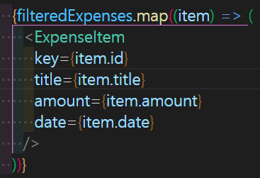

## 섹션5. Rendering Lists & Conditional Content

### 동적으로 데이터 리스트 렌더링 하기

기존 프로젝트에서는 `Expenses`를 받아 정적으로 렌더링하였다.

정적인 렌더링은 유저와 상호작용이 반영되기 어렵고, 개발자 입장에서도 많은 정보를 수동으로 수정해야할 경우가 발생하므로 좋은 방식은 아니다.

그러므로 이제 동적인 방식으로 데이터를 화면에 렌더링 하는 방법을 적용해보자

###

**map() 메서드**

map()은 자바스크립트의 메서드 중 하나이다.
배열을 기준으로 동작하며, 조건에 따라 **새로운**배열로 반환해준다.
새로운 배열을 만들기 때문에 기존 정보에 영향을 미치지 않으며,
불변성과 안정성을 보장한다.

더 자세한 내용: <a href='https://developer.mozilla.org/ko/docs/Web/JavaScript/Reference/Global_Objects/Array/map'>MDN 공식 문서 - map()</a>

### state변경을 동적으로 적용하기

`state`와 `setState`를 이용하여 값을 동적으로 표현한다면 유저와 상호작용할 수 있는 기능을 구현할 수 있다.

**setState**
setState를 통해 추가 정보를 받아 기존 state를 업데이트 할 수 있다. 이것은 다른 컴포넌트로 받아온 props를 통해서 혹은 해당 컴포넌트의 로직에 의해 가능하다. 아래의 코드를 통해 살펴보자.

```
--- 생략 ---

const [expenses, setExpenses] = useState([])

const expensesUpdateHandler = (newExpense) => {
    setExpenses([newExpense, ...expenses])
}

--- 생략 ---
```

`expensesUpdateHandler` 함수는 새로운 값이 추가되는 어떠한 이벤트가 발생할 때마다 실행될 것이다. 그럴 때마다 우리는 변경된 값이 화면에 반영되는 것을 원하기 때문에 state를 업데이트 시켜줄 것이다.

기존 state를 spread 연산자를 이용하여 배열에 있는 모든 객체를 나열시킨후, **새로운 값**으로 들어온 `newExpense`를 추가시켜준다.

하지만, 이런 방식으로 state를 업데이트 하는 것은 React에서 좋지 않다는 것을 앞서 배운 바 있다.

리액트는 state를 주시하다가 업데이트 발생시 순서에 따라 state 업데이트 스케쥴링을 실행한다.

일반적으로는 문제가 없지만, **복잡하거나 동시다발적인 state 업데이트가 일어날 경우, 그 과정 에서 충돌**이 일어날 수 있기 때문이다.

그렇기 때문에 다음과 같은 방식이 안정적으로 state를 업데이트하는 법이다.

```
--- 생략 ---

const [expenses, setExpenses] = useState([])

const expensesUpdateHandler = (newExpense) => {
    setExpenses((prevExpenses) => (
        [newExpense, ...prevExpenses]
    ))
}

--- 생략 ---
```

**prevExpenses**

- React는 이전 state값을 기억하고 있다가, state업데이트 시 정확히 그 이전 값을 setState의 인자로 반환한다.
- setState안에서 일종의 callback함수의 반환값을 가져와 사용하는 것이다.

### key 오류

동적인 렌더링을 하기 위해 React에서 map()메소드를 사용하는 것은 아주 흔한 일이다.

이때, 콘솔창을 보면 key값이 필요하다는 오류를 볼 수 있다.
이것은 리액트가 나열되는 비슷한 컴포넌트를 무엇이 어떤 것인지 판단하기 위해 필요한 `고유값`이다.

예를 들어, 동적으로 생성된 컴포넌트 중 하나를 클릭했을 때, 그 컴포넌트만 삭제되는 기능이 있다고 해보자.
컴포넌트의 모든 내용이 다르다고 했을 때는 그 내용을 비교하여 컴포넌트를 구분할 수도 있지만, 모든 컴포넌트의 내용이 같을 경우 어떤 것이 클릭한 컴포넌트인지 가릴 수 있는 방법이 없다.
또한, 리액트가 각 컴포넌트의 모든 요소를 비교하여 판단하는 것은 비효율적이기도 하다.

대신에 각 컴포넌트 마다 **고유의** `key`값을 부여하여, `key`값 하나로 컴포넌트를 구별할 수 있게 하는 것이다. 어떠한 이벤트에 의해 re-render이 발생할 때, React는 `key`값만으로 컴포넌트를 구별하여 **정확히 변경이 일어난 컴포넌트에만** 반영할 수 있게 된다..

**key**

- 개발자나, 사용자가 이용하는 값 ( x )
- React가 식별하기 위한 값 ( o )
- 모든 HTML태그에서 사용할 수 있다.(커스텀 컴포넌트, 내장 HTML 태그 등)

### filter 적용하기

기존에는 props를 통해 받아온 items (지출 내용이 담긴 객체로 이루어진 배열)을 map() 메서드를 통해 나열하였다.

이제, 연도 선택 드롭다운에 의해 선택된 연도에 해당되는 지출 내역만 렌더링 하고 싶다. 어떻게 해야할까?


다양한 방법으로 처리할 수 있겠지만, 가장 심플하고 사용하기 쉬운 방법은 다음과 같다.

**filter() 메서드**

- props로 받아온 items에 filter()메소드를 적용한다.
- filter()메서드는 지정된 값과 일치하는 값일 경우만 **필터링하여 새로운 배열로 반환**한다.
  

- 반환된 배열을 변수에 담고(정의) 그 배열을 기준으로 map()을 통해 렌더링 한다.
  

  더 자세한 내용: <a href='https://developer.mozilla.org/ko/docs/Web/JavaScript/Reference/Global_Objects/Array/filter'>MDN 공식 문서 - filter()</a>
